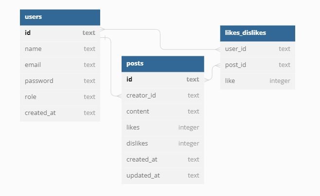

# Projeto Labook Back-end

> Status: Em desenvolvimento ⚠️

### Descrição:

Projeto de criação de API com funcionadades CRUD integradas a criação de usuário (com autenticação em jwt token), posts e função de like/dislike com rotas protegidas, implementados a biblioteca de dados em SQLite3.

### Deploy:

https://labook-tc2e.onrender.com 
(no ar até 05/06/2023)

### Documentação da API:

https://labook-tc2e.onrender.com/docs

ou

```ubuntu
$ npm install

$ npm run swagger

$ npm run dev || $ npm run start

```

### Estruturação do banco de dados:

<br>



### RFs (Requisitos funcionais)

- [x] Deve ser possível se cadastrar;
- [x] Deve ser possível se autenticar;
- [x] Deve ser possível obter lista de posts;
- [x] Deve ser possível criar um post;
- [x] Deve ser possível editar um post;
- [x] Deve ser possível deletar um post;
- [x] Deve ser possível dar like/dislike em um post;

### RNs (Regras de negócio)

- [x] O usuário não deve poder se cadastrar com um e-mail duplicado;
- [x] O post sempre deverá ter um usuário;
- [x] O usuário não deve poder dar like/dislike no próprio post;
- [x] Caso usuário dê um dislike em um post que já tenha dado dislike, o dislike é desfeito (deleta o item da tabela);
- [x] Caso usuário dê um like em um post que já tenha dado like, o like é desfeito (deleta o item da tabela);
- [x] Caso usuário dê um like em um post que tenha dado dislike, o like sobrescreve o dislike.
- [x] Caso usuário dê um dislike em um post que tenha dado like, o dislike sobrescreve o like.

### RNFs (Requisitos não-funcionais)

- [x] A senha do usuário precisa estar criptografada;
- [x] Os dados da aplicação precisam estar persistidos em um banco SQLite;
- [x] O usuário deve ser identificado por um JJWT (JSON Web Token);
- [x] Testes unitários;

### Funcionalidades em desenvolvimento:

- [ ] Testes E2E

### Tecnologias utilizadas:

<table>
<tr>
<td>Node.js</td>
<td>Typescript</td>
<td>Express</td>
<td>Knex</td>
<td>Sqlite3</td>
<td>Vitest</td>

</tr>
<tr>
<td>8.19.3</td>
<td>5.0.2</td>
<td>4.18.2</td>
<td>2.4.2</td>
<td>5.1.6</td>
<td>0.30.1</td>
</tr>
</table>

## Dependências:

<table>
<tr>
<td>bcryptjs</td>
<td>jsonwebtoken</td>
<td>swagger-ui</td>
<td>tsoa</td>
<td>zod</td>

</tr>
<tr>
<td>2.4.2</td>
<td>9.0.2</td>
<td>4.1.3</td>
<td>5.1.1</td>
<td>3.21.4</td>
</tr>
</table>

## Como rodar a aplicação

```ubuntu
$ git clone linkrep

$ npm install

$ npm run dev

```

### Contato:

e-mail: lnataliaperri@gmail.om

[](https://www.linkedin.com/in/natalia-perri/)
